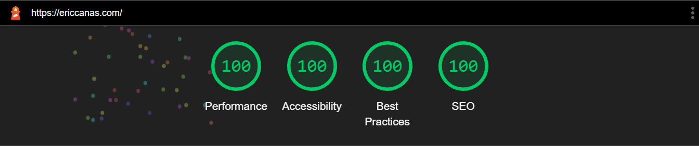

<h1 align="center"> Welcome to my <a href="https://ericcanas.com/" target="_blank">Portfolio</a>  </h1>
This portfolio is a <b>Serverless</b> <b>Static Website</b> developed with  and , stylized with . Its content is queried from <a href="https://www.contentful.com/" target="_blank"><i><b>Contentful</b></i></a>, a <b>Headless CMS</b>, using . 

This website is hosted at <b><a href="https://ericcanas.com/" target="_blank">ericcanas.com</a></b>. It is available in <b><a href="https://ericcanas.com/en" target="_blank">&thinsp;English</a></b> and <b><a href="https://ericcanas.com/es" target="_blank">&thinsp;Spanish</a></b>.

<h2> About Me </h2>

  
 
 
 
 
  
<b>Freelancer</b> <b>Computer Engineer</b> and <b>Artificial Intelligence</b> Specialist, specialized in <b>Computer Vision</b>.  

Graduated in <b>Computer Engineering</b> (specialization in <b>Computing</b>) [<i>UAB</i>] with <a href="https://ericcanas.com/academic-background/" target="_blank">Honor Marks in 17 Subjects</a>. Graduated from the <b>Master in Artificial Intelligence</b> [<i>UPC</i>] with <a href="https://ericcanas.com/academic-background/" target="_blank">Honor Marks in 3 Subjects</a>. Awarded as the <a href="https://drive.google.com/file/d/1lPAdt6uIdZTUporimYOh4IsLWDwxtZj8/view?usp=sharing" target="_blank">2nd best student of the promotion</a> (147 students) and <b>1st of specialization</b>. Author of <a href="https://ericcanas.com/publications/" target="_blank">publications</a> in <b>international conferences</b> [<i>Tier A2</i>].  

More than <a href="https://ericcanas.com/professional-experience/" target="_blank">3 years of experience</a> as <b>Computer Vision Engineer</b> and <b>Researcher</b>. First at the <b>Computer Vision Center</b> and later at the <b>Department of Applied Physics</b> of the <b>UB</b>. Actually working for <a href="https://www.clutchapp.io/" target="_blank">Clutch</a>, a Danish <b>Start Up</b> developing a <b>Virtual Badminton Coach</b> that gives <b>real time performance feedback</b> to professional and amateur players.  

Specialized in <b>Deep Learning</b> and <b>High Performance Computing</b>. <b>React</b> enthusiast. Very interested to deepen in the development of <b>PWA</b>, <b>Serverless applications</b> and <b>Cloud Services</b>.  

<h2>Homepage Lighthouse Metrics</h2>

